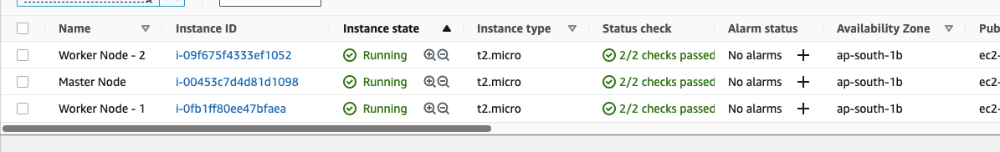
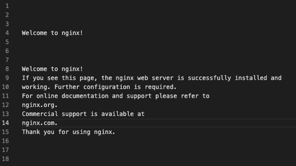
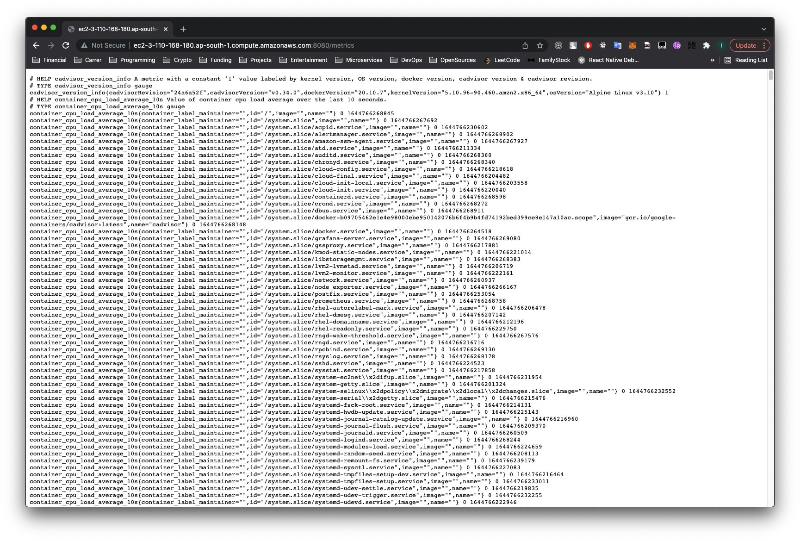

# DevOpsTechnicalChallenge
## Purpose:

This challenge is designed to test the SRE/DevOps candidate’s understanding and abilities in
the following areas of infrastructure as code:
* Cloud access management
* Cloud networking
* Security concerns awareness
* Automation and clean coding practices
* Containerization concepts

## Tasks:
####  1. Use Terraform or Ansible or CloudFormation   to automate the following tasks against any cloud provider platform, e.g. AWS, GCP, Aliyun.

  ```
  This challenge is using Ansible for automate the procedures of following tasks against AWS.
  ```


####   2. Provision a new VPC and any networking related configurations.
  ```
  ansible-playbook -i hosts.inventory create-vpc-network-gateway-env.yml --vault-password-file ansibled.vault --ask-become-pass -vv
  ```
  Role included:
  ```
  - hosts: vpc
  vars: #local connection defaults to using the system python
    ansible_python_interpreter: /Users/lauchiulam/Projects/DevOpsTechnicalChallenge/venv/bin/python3
  vars_files: 
    - roles/vpc-network-gateway-setup/vars/cred.yml
    - roles/vpc-network-gateway-setup/vars/main.yml
    - roles/vpc-network-gateway-setup/vars/vpc.ansibled.yml
  environment:
    AWS_ACCESS_KEY_ID: "{{ aws_access_key }}"
    AWS_SECRET_ACCESS_KEY: "{{ aws_secret_key }}"
    AWS_REGION: "{{ aws_region }}"
  tasks:
    - include_tasks: /Users/lauchiulam/Projects/DevOpsTechnicalChallenge/roles/vpc-network-gateway-setup/tasks/main.yml
  ```
  Those tasks are covered:
  - create VPC
  - Set VPC ID in variable
  - associate subnet to the VPC
  - create IGW
  - Route IGW
  - Create Security Group
  - create a new ec2 key pair, returns generated private key
  - Copy EC2 Key Pair private key locally
  - Create EC2 Instance ( for connection test only )

  Some screen capture:
  ### - vpc
  
  ### - security group
  
  ### - simple high-level network diagram
  
  ### for multiple subnet setup, can refer to role setup-vpc.yml, setup-gateways.yml and facts.yml

####   3. In this environment provision a virtual machine instance, with an OS of your choice.
 
  Playbook:
  ```
  ansible-playbook -i hosts.inventory ec2-k8s-setup.yml --vault-password-file ansibled.vault --ask-become-pass
  ```

  Role include:
  ```
   - hosts: localhost
   gather_facts: no
   tasks:
     - name: Running EC2 Role
       include_role:
         name: ec2_instances
  ```
  Those tasks are covered:
  - Installing boto library in base os
  - Launching Master node
  - Updating the master node's public ip in inventory
  - Launching Worker node 
  - Updating the worker node's public ip in inventory 

  ### - ec2 instances
  

####   4. Apply any security hardening (OS, firewall, etc..) you see fit for the VM instance.
  Playbook:
  ```
  ansible-playbook -i hosts.inventory ec2-harnening.yml --ask-become-pass -vvvvv 
  ```
  Role include:
  ```
  - name: ec2 security hardening
  become: true
  vars:
    allowed_ssh_networks:
      - 192.168.122.0/24
      - 10.10.10.0/24
    unnecessary_services:
      - postfix
      - telnet
    unnecessary_software:
      - tcpdump
      - nmap-ncat
      - wpa_supplicant
  tasks:
  hosts: ec2
  roles:
    - hardening
  handlers:
  - name: Reload SSH
    service:
      name: sshd
      state: reloaded
  ```
  Those tasks are covered:
  - Perform full patching
  - Add admin group
  - Add local user
  - Set authorized key for user admin copying it from current user
  - Add SSH public key for user
  - Add sudoer rule for local user
  - Add hardened SSH config
  - Add SSH port to internal zone
  - Add permitted networks to internal zone
  - Drop ssh from the public zone
  - Remove undesirable packages
  - Stop and disable unnecessary services
  - Set a message of the day
  - Set a login banner
  - open firewall ports ( MASTERS )
  - open firewall ports ( WORKERS )
  - Turn on and enable firewalld
  
####   5. Install Docker CE on that VM instance.
  Playbook:
  ```
  ansible-playbook -i hosts.inventory ec2-k8s-setup.yml --vault-password-file ansibled.vault --ask-become-pass
  ```
  Role include:
  Part of { role: sample-docker-nginx-app }
  Those tasks are covered:
  - Installing Docker
  - Staring & enabling Docker
  - Updating Docker cgroup on Master Node
  - Restart docker on Node
  
####   6. Deploy/Start an Nginx container on that VM instance.
  Playbook:
  ```
  ansible-playbook -i hosts.inventory ec2-k8s-setup.yml --vault-password-file ansibled.vault --ask-become-pass
  ```
  Role include:
  ```
  - name: sample nginx app
  hosts: demo-ec2
  become: true
  roles:
  - { role: sample-docker-nginx-app }
  ```
  Those tasks are covered:
  - name: deploy and start nginx docker container

####   7. Demonstrate how you would test the healthiness of the Nginx container.
  Playbook:
  ```
  ansible-playbook -i hosts.inventory monitoring-tools-setup.yml --vault-password-file ansibled.vault --ask-become-pass
  ```
  Role include:
  ```
  - name: sample nginx app
  hosts: demo-ec2
  become: true
  roles:
  - { role: sample-docker-nginx-app }
  ```
  Those tasks are covered:
  - Copy Dockerfile to host
  - Build an nginx image with health check curl
  - deploy and start nginx docker container
  #### The nginx container status with "healthy"
  
  #### The inspect of State.Health of nginx container
  

####  8. Expose the Nginx container to the public web on port 80.
#### - nginx is able to access form port 80 


####   9. Fetch the output of the Nginx container’s default welcome page.
  Playbook:
  ```
  ansible-playbook -i hosts.inventory fetching-webpage.yml --ask-become-pass
  ```
  Those tasks are covered:
  - Create a Directory for storage output 
  - Download output txt file by get_url
  
  #### The output txt.file:
  

####   10. Excluding any HTML/JS/CSS tags and symbols, output the words and their frequency count for the words that occurred the most times on the default welcome page.
  Playbook:
  ```
  ansible-playbook -i hosts.inventory fetching-webpage.yml --ask-become-pass
  ```
  Role include:
  Those tasks are covered:
  - Create a Directory for storage output 
  - Download output txt file by get_url
  - Count for the words that occurred the most times on the default welcome page
  - save counted_output
  #### The html content after excluding the HTML/JS/CSS tags and symbols
  
  #### The 2 most common words in the welcome page
  ```
  [["to", 3], ["is", 3]]
  ```

  
####   11. Demonstrate how you would log the resource usage of the containers every 10 seconds.
Playbook:
```
ansible-playbook -i hosts.inventory monitoring-tools-setup.yml --vault-password-file ansibled.vault --ask-become-pass
```
Role include:
```
- hosts: alertmanager
  become: true
  become_user: root
  become_method: sudo
  roles:
    - alertmanager

- hosts: node_exporter
  become: true
  become_user: root
  become_method: sudo
  roles:
    - prometheus_node_exporter

- hosts: cAdvisor
  become: true
  become_user: root
  become_method: sudo
  roles:
    - cAdvisor

- hosts: prometheus
  become: true
  become_user: root
  become_method: sudo
  roles:
    - prometheus

- hosts: grafana
  become: true
  become_user: root
  become_method: sudo
  roles:
    - grafana
```
Those tasks are covered:
1. alertmanager
- Creating alertmanager user group
- Creating alertmanager user
- Download alertmanager
- Copy alertmanager executable to bin
- Delete alertmanager tmp folder
- Creates data directory
- Creates config directory
- Copy config file
- Copy systemd init file
- Start alertmanager service
- Check if alertmanager is accessible

2. node_exporter
- Creating node_exporter user group
- Creating node_exporter user
- Install prometheus node exporter
- Copy prometheus node exporter file to bin
- Delete node exporter tmp folder
- Copy systemd init file
- Start node_exporter service
- Check if node 

3. cAdvisor
- Deploy Container Advisor

4. prometheus
- Creating prometheus user group
- Creating prometheus user
- Install prometheus
- Copy prometheus file to bin
- Delete prometheus tmp folder
- Creates directory 
- config file
- alert config file
- Copy systemd init file
- Start prometheus service
- Check if prometheus is accessible

4. grafana
- Install grafana
- Grafana configuration file copy
- Grafana server started
- Check if Grafana is accessible

Grafana home page


Updating Prometheus Data Source in Grafana.


cAdvisor showing processes and containers resource utilization



Prometheus scraping cAdvisor metrics and showing all container metrics


The resource usage of the containers every 10 seconds


## Bonus Points:
#### 1. Replace VM instance(s) with K8S cluster
  Playbook:
  ```
  ansible-playbook -i hosts.inventory ec2-k8s-setup.yml --vault-password-file ansibled.vault --ask-become-pass
  ```
  Role include:
  ```
   - name: cell roles
   hosts: all
   become: true
   roles:
   - { role: configure_hosts }
   - { role: k8s_kubeadm_install }
   - { role: k8s_cluster_init }
  ```
  Those tasks are covered:
  
  1. role: configure_hosts
  - Assign hostname for worker 01
  - Assign hostname for worker 02
  - Assign hostname for K8's Master
  - Copy /etc/hosts
  - Change the login banner
  - Change Banner option in /etc/ssh/sshd_config
  - Restsart sshd service

  2. role: k8s_kubeadm_install
  - Remove existing gpg keys and repos to prevent issues
  - Add kubeadm repositories on Node
  - Installing Docker & kubeadm on Node
  - Staring & enabling Docker & kubelet on Node
  - Updating Docker cgroup on Master Node
  - Restart docker on Master Node

  3. role: k8s_kubeadm_install
  - Reset kubeadm
  - Pulling the images of k8s master
  - Initializing k8s cluster
  - Create $HOME/.kube directory
  - Copy admin config to ec2-user
  - Gather admin.conf
  - Fetch admin.conf to ansible controller
  - Distribute admin.conf to workers
  - Create token and hash ans parse them out
  - Parse join file for token and create token variable
  - Create token var
  - Output token variable
  - Parse join file for hash and create hash variable
  - add token and hash to dummy host to pass facts between hosts
  - Copy kube-flannel.yml to host
  - Apply flannel
  - Join worker nodes to cluster
  - Sleep for 1 minute to give pods time to come up 
  - Restart containerd incase cni0 didnt get created
  
  ##### - kubectl get nodes
  ```
      NAME                                         STATUS   ROLES                  AGE     VERSION
  ip-172-31-0-20.ap-south-1.compute.internal   Ready    <none>                 6m26s   v1.23.3
  ip-172-31-3-35.ap-south-1.compute.internal   Ready    control-plane,master   24m     v1.23.3
  ip-172-31-7-65.ap-south-1.compute.internal   Ready    <none>                 81s     v1.23.3
  ```
#### 2. Use AWS as cloud provider platform
```
yes, AWS is in used.
```
#### 3. Use Terraform instead of Ansible or CloudFormation
```
No, ansible is in used.
```
#### 4. Visualize monitoring with metrics query language
query sample from grafana:
```
promhttp_metric_handler_requests_total
```


####  5. Submit your solution with git and README
```
yes, git and README is submitted as:

```